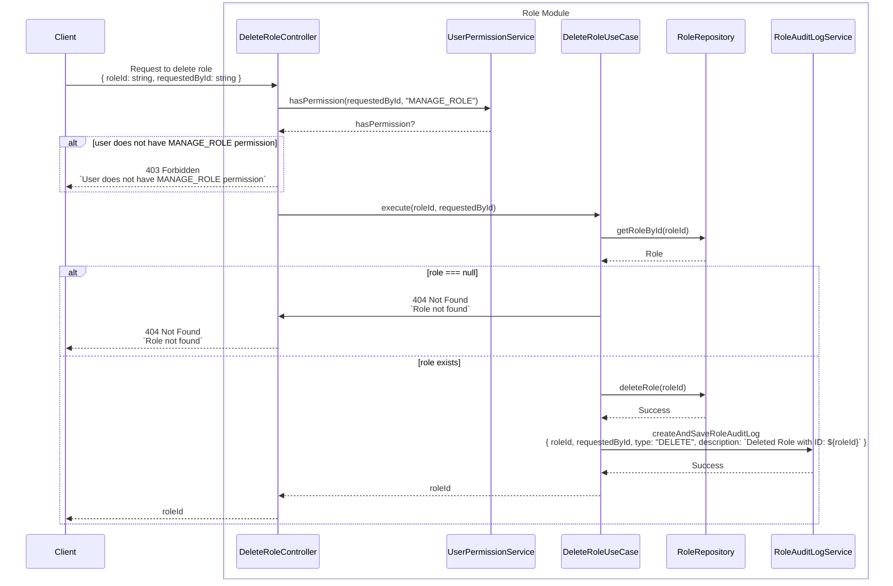

# Delete Role UseCase

```mermaid
sequenceDiagram
    participant Client

    box Role Module
        participant DeleteRoleController
        participant UserPermissionService
        participant DeleteRoleUseCase
        participant RoleRepository
        participant RoleAuditLogService
    end

    Client ->> DeleteRoleController: Request to delete role<br/>{ roleId: string, requestedById: string }
    DeleteRoleController ->> UserPermissionService: hasPermission(requestedById, "MANAGE_ROLE")
    UserPermissionService -->> DeleteRoleController: hasPermission?
    alt user does not have MANAGE_ROLE permission
        DeleteRoleController -->> Client: 403 Forbidden<br/>`User does not have MANAGE_ROLE permission`
    end

    DeleteRoleController ->> DeleteRoleUseCase: execute(roleId, requestedById)
    DeleteRoleUseCase ->> RoleRepository: getRoleById(roleId)
    RoleRepository -->> DeleteRoleUseCase: Role
    alt role === null
        DeleteRoleUseCase ->> DeleteRoleController: 404 Not Found<br/>`Role not found`
        DeleteRoleController -->> Client: 404 Not Found<br/>`Role not found`
    else role exists
        DeleteRoleUseCase ->> RoleRepository: deleteRole(roleId)
        RoleRepository -->> DeleteRoleUseCase: Success
        DeleteRoleUseCase ->> RoleAuditLogService: createAndSaveRoleAuditLog<br/>{ roleId, requestedById, type: "DELETE", description: `Deleted Role with ID: ${roleId}` }
        RoleAuditLogService -->> DeleteRoleUseCase: Success
        DeleteRoleUseCase -->> DeleteRoleController: roleId
        DeleteRoleController -->> Client: roleId
    end
```