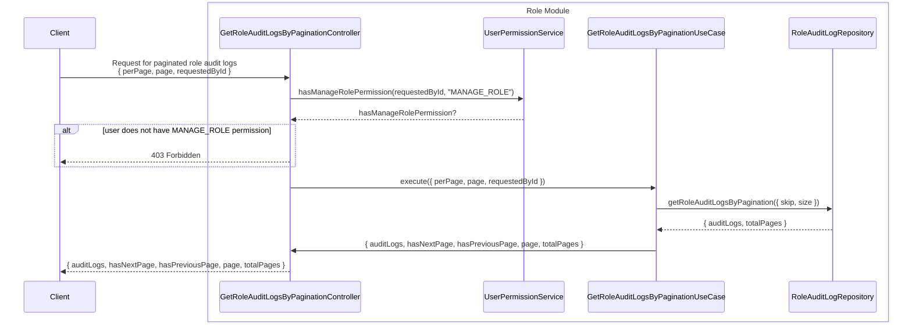

# Get Role Audit Logs By Pagination UseCase

```mermaid
sequenceDiagram
    participant Client

    box Role Module
        participant GetRoleAuditLogsByPaginationController
        participant UserPermissionService
        participant GetRoleAuditLogsByPaginationUseCase
        participant RoleAuditLogRepository
    end

    Client ->> GetRoleAuditLogsByPaginationController: Request for paginated role audit logs <br/> { perPage, page, requestedById }
    GetRoleAuditLogsByPaginationController ->> UserPermissionService: hasManageRolePermission(requestedById, "MANAGE_ROLE")
    UserPermissionService -->> GetRoleAuditLogsByPaginationController: hasManageRolePermission?
    alt user does not have MANAGE_ROLE permission
        GetRoleAuditLogsByPaginationController -->> Client: 403 Forbidden
    end

    GetRoleAuditLogsByPaginationController ->> GetRoleAuditLogsByPaginationUseCase: execute({ perPage, page, requestedById })
    GetRoleAuditLogsByPaginationUseCase ->> RoleAuditLogRepository: getRoleAuditLogsByPagination({ skip, size })
    RoleAuditLogRepository -->> GetRoleAuditLogsByPaginationUseCase: { auditLogs, totalPages }
    GetRoleAuditLogsByPaginationUseCase ->> GetRoleAuditLogsByPaginationController: { auditLogs, hasNextPage, hasPreviousPage, page, totalPages }
    GetRoleAuditLogsByPaginationController -->> Client: { auditLogs, hasNextPage, hasPreviousPage, page, totalPages }
```