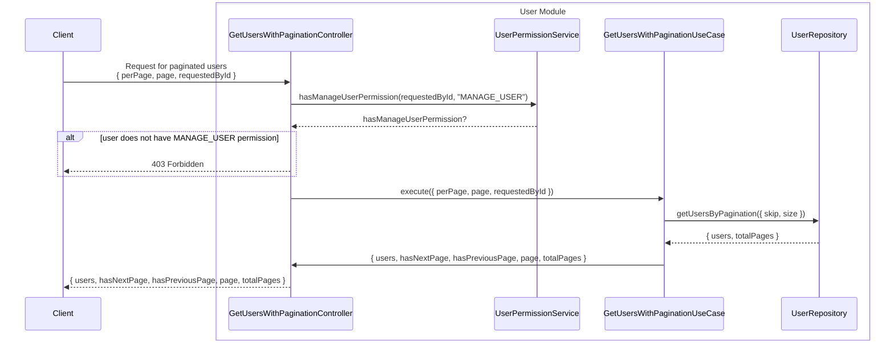

# Get Users With Pagination Use Case

```mermaid
sequenceDiagram
    participant Client

    box User Module
        participant GetUsersWithPaginationController
        participant UserPermissionService
        participant GetUsersWithPaginationUseCase
        participant UserRepository
    end

    Client ->> GetUsersWithPaginationController: Request for paginated users <br/> { perPage, page, requestedById }
    GetUsersWithPaginationController ->> UserPermissionService: hasManageUserPermission(requestedById, "MANAGE_USER")
    UserPermissionService -->> GetUsersWithPaginationController: hasManageUserPermission?
    alt user does not have MANAGE_USER permission
        GetUsersWithPaginationController -->> Client: 403 Forbidden
    end

    GetUsersWithPaginationController ->> GetUsersWithPaginationUseCase: execute({ perPage, page, requestedById })
    GetUsersWithPaginationUseCase ->> UserRepository: getUsersByPagination({ skip, size })
    UserRepository -->> GetUsersWithPaginationUseCase: { users, totalPages }
    GetUsersWithPaginationUseCase ->> GetUsersWithPaginationController: { users, hasNextPage, hasPreviousPage, page, totalPages }
    GetUsersWithPaginationController -->> Client: { users, hasNextPage, hasPreviousPage, page, totalPages }
```
