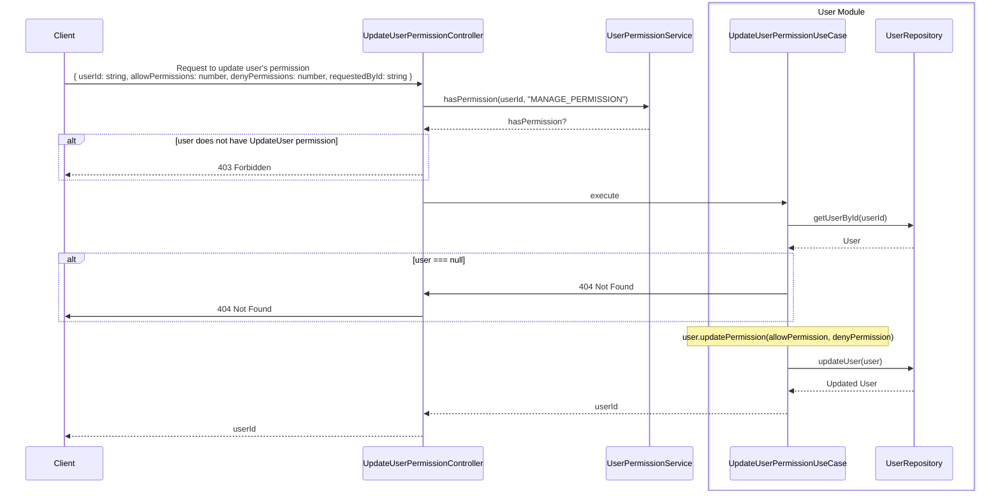

# Update User Permission UseCase

```mermaid
sequenceDiagram
  participant Client as Client
  participant UpdateUserPermissionController as UpdateUserPermissionController
  participant UserPermissionService as UserPermissionService
  participant UpdateUserPermissionUseCase as UpdateUserPermissionUseCase
  participant UserRepository as UserRepository

  Client ->> UpdateUserPermissionController: Request to update user's permission <br/> { userId: string, allowPermissions: number, denyPermissions: number, requestedById: string }
  UpdateUserPermissionController ->> UserPermissionService: hasPermission(userId, "MANAGE_PERMISSION")
  UserPermissionService -->> UpdateUserPermissionController: hasPermission?
  alt user does not have UpdateUser permission
    UpdateUserPermissionController -->> Client: 403 Forbidden
  end
  UpdateUserPermissionController ->> UpdateUserPermissionUseCase: execute
  UpdateUserPermissionUseCase ->> UserRepository: getUserById(userId)
  UserRepository -->> UpdateUserPermissionUseCase: User
  alt user === null
    UpdateUserPermissionUseCase ->> UpdateUserPermissionController: 404 Not Found
    UpdateUserPermissionController ->> Client: 404 Not Found
  end
  Note over UpdateUserPermissionUseCase: user.updatePermission(allowPermission, denyPermission)
  UpdateUserPermissionUseCase ->> UserRepository: updateUser(user)
  UserRepository -->> UpdateUserPermissionUseCase: Updated User
  UpdateUserPermissionUseCase -->> UpdateUserPermissionController: userId
  UpdateUserPermissionController -->> Client: userId

  box transparent User Module
  participant UpdateUserPermissionController
  participant UpdateUserPermissionUseCase
  participant UserRepository
  end
```
