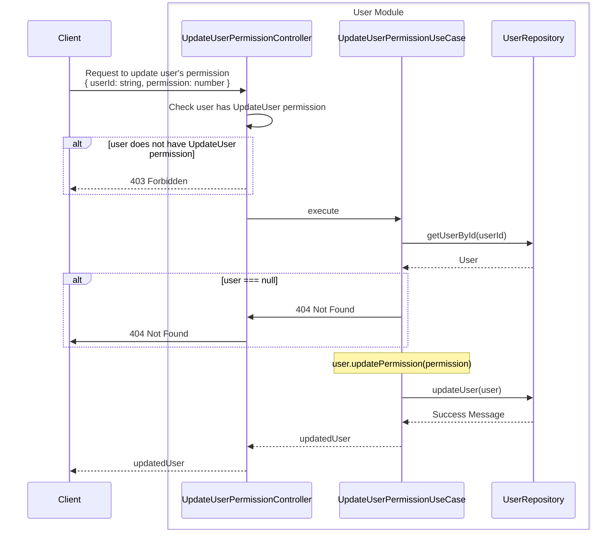

# Update User Permission UseCase

```mermaid
sequenceDiagram
    participant Client

    box User Module
        participant UpdateUserPermissionController
        participant UpdateUserPermissionUseCase
        participant UserRepository
    end

    Client ->> UpdateUserPermissionController: Request to update user's permission <br/> { userId: string, permission: number }
    UpdateUserPermissionController ->> UpdateUserPermissionController: Check user has UpdateUser permission
    alt user does not have UpdateUser permission
        UpdateUserPermissionController -->> Client: 403 Forbidden
    end

    UpdateUserPermissionController ->> UpdateUserPermissionUseCase: execute
    UpdateUserPermissionUseCase ->> UserRepository: getUserById(userId)
    UserRepository -->> UpdateUserPermissionUseCase: User

    alt user === null
        UpdateUserPermissionUseCase ->> UpdateUserPermissionController: 404 Not Found
        UpdateUserPermissionController ->> Client: 404 Not Found
    end

    Note over UpdateUserPermissionUseCase: user.updatePermission(permission)
    UpdateUserPermissionUseCase ->> UserRepository: updateUser(user)
    UserRepository -->> UpdateUserPermissionUseCase: Success Message
    UpdateUserPermissionUseCase -->> UpdateUserPermissionController: updatedUser
    UpdateUserPermissionController -->> Client: updatedUser
```
