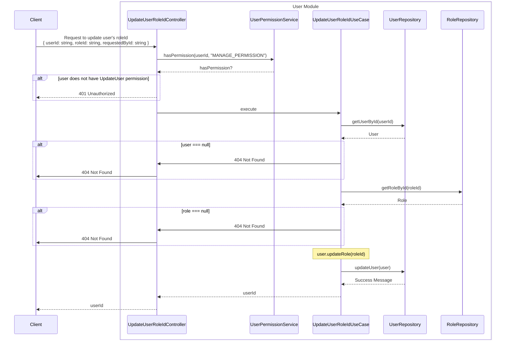

# Update User RoleId UseCase

```mermaid
sequenceDiagram
    participant Client

    box User Module
        participant UpdateUserRoleIdController
        participant UserPermissionService
        participant UpdateUserRoleIdUseCase
        participant UserRepository
        participant RoleRepository
    end

    Client ->> UpdateUserRoleIdController: Request to update user's roleId <br/> { userId: string, roleId: string, requestedById: string }
    UpdateUserRoleIdController ->> UserPermissionService: hasPermission(userId, "MANAGE_PERMISSION")
    UserPermissionService -->> UpdateUserRoleIdController: hasPermission?
    alt user does not have UpdateUser permission
        UpdateUserRoleIdController -->> Client: 401 Unauthorized
    end

    UpdateUserRoleIdController ->> UpdateUserRoleIdUseCase: execute
    UpdateUserRoleIdUseCase ->> UserRepository: getUserById(userId)
    UserRepository -->> UpdateUserRoleIdUseCase: User
    alt user === null
        UpdateUserRoleIdUseCase ->> UpdateUserRoleIdController: 404 Not Found
        UpdateUserRoleIdController ->> Client: 404 Not Found
    end

    UpdateUserRoleIdUseCase ->> RoleRepository: getRoleById(roleId)
    RoleRepository -->> UpdateUserRoleIdUseCase: Role
    alt role === null
        UpdateUserRoleIdUseCase ->> UpdateUserRoleIdController: 404 Not Found
        UpdateUserRoleIdController ->> Client: 404 Not Found
    end

    Note over UpdateUserRoleIdUseCase: user.updateRole(roleId)
    UpdateUserRoleIdUseCase ->> UserRepository: updateUser(user)
    UserRepository -->> UpdateUserRoleIdUseCase: Success Message
    UpdateUserRoleIdUseCase -->> UpdateUserRoleIdController: userId
    UpdateUserRoleIdController -->> Client: userId
```
