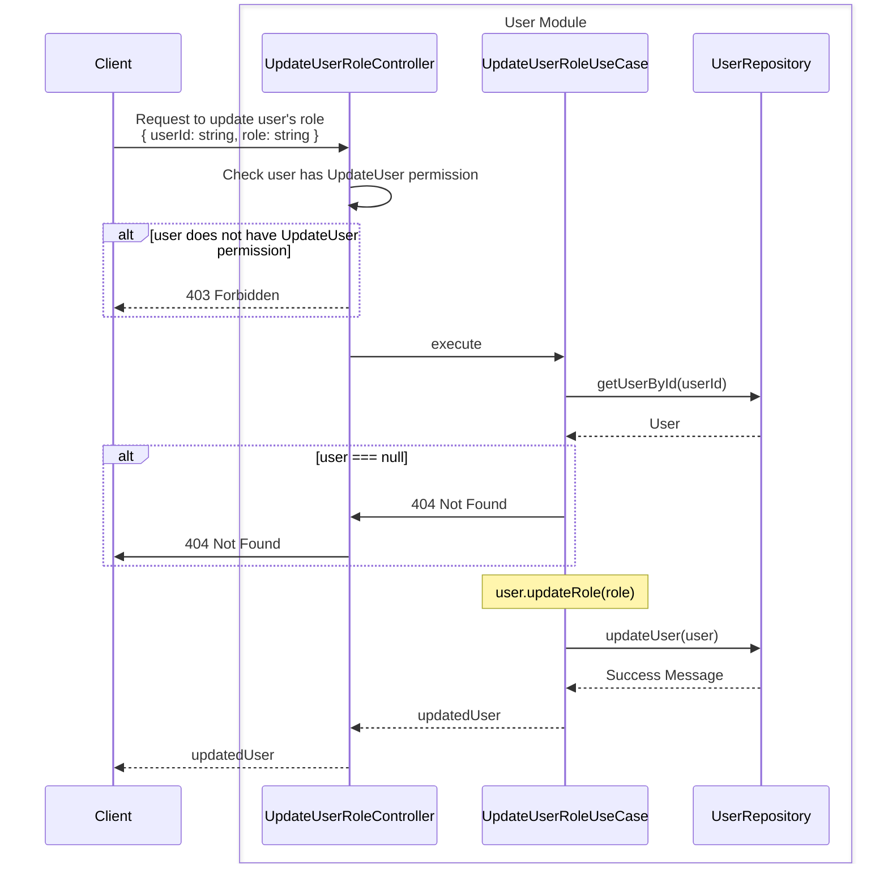

# Update User Role UseCase

```mermaid
sequenceDiagram
    participant Client

    box User Module
        participant UpdateUserRoleController
        participant UpdateUserRoleUseCase
        participant UserRepository
    end

    Client ->> UpdateUserRoleController: Request to update user's role <br/> { userId: string, role: string }
    UpdateUserRoleController ->> UpdateUserRoleController: Check user has UpdateUser permission
    alt user does not have UpdateUser permission
        UpdateUserRoleController -->> Client: 403 Forbidden
    end

    UpdateUserRoleController ->> UpdateUserRoleUseCase: execute
    UpdateUserRoleUseCase ->> UserRepository: getUserById(userId)
    UserRepository -->> UpdateUserRoleUseCase: User

    alt user === null
        UpdateUserRoleUseCase ->> UpdateUserRoleController: 404 Not Found
        UpdateUserRoleController ->> Client: 404 Not Found
    end

    Note over UpdateUserRoleUseCase: user.updateRole(role)
    UpdateUserRoleUseCase ->> UserRepository: updateUser(user)
    UserRepository -->> UpdateUserRoleUseCase: Success Message
    UpdateUserRoleUseCase -->> UpdateUserRoleController: updatedUser
    UpdateUserRoleController -->> Client: updatedUser
```
